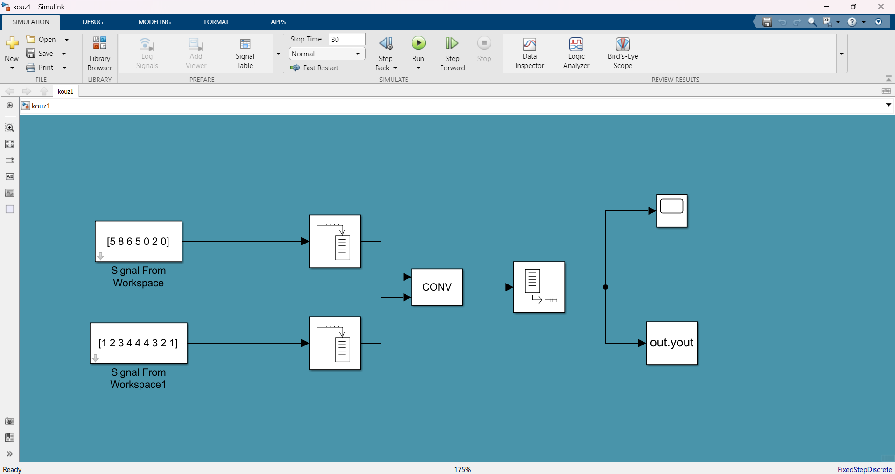
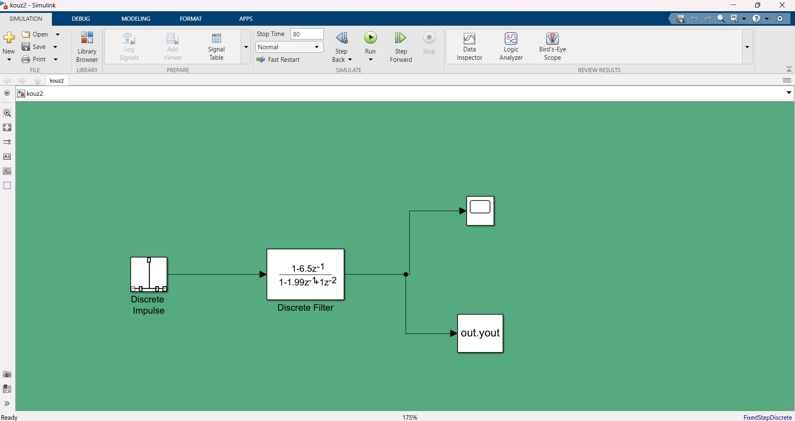
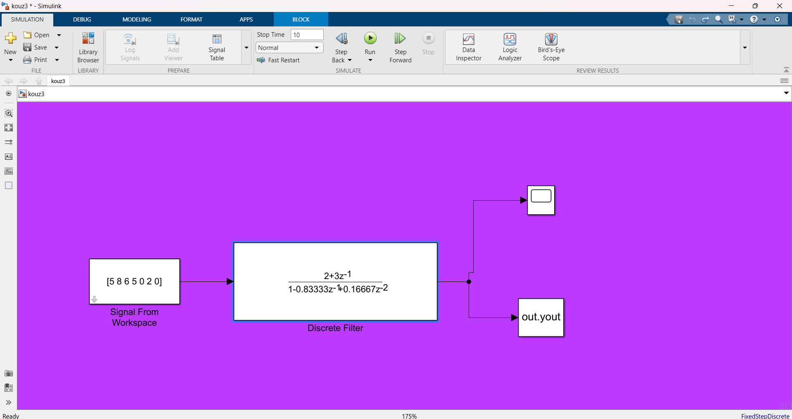

## Digital_Signal_Processing_SIMULINK

## kouz_laboratory_1

Τα αρχεια αφορουν στον υπολογισμο της συνεληξης , του αντιστροφου μετασχηματισμου Z  με χρηση Simulink του MATLAB 
Οι εκφωνησεις των κουζς ειναι [κουζ1.pdf](https://github.com/HerGousis/Digital_Signal_Processing_SIMULINK/blob/main/kouz_laboratory_1/help4quiz_0101_v2.pdf) , [κουζ2.pdf](https://github.com/HerGousis/Digital_Signal_Processing_SIMULINK/blob/main/kouz_laboratory_1/help4quiz_0202_v2.pdf) , [κουζ3.pdf](https://github.com/HerGousis/Digital_Signal_Processing_SIMULINK/blob/main/kouz_laboratory_1/help4quiz_0204_v2.pdf)

 <div style="text-align:center;">
    
</div>

και γραφουμε στο ```MATLAB```
```
quiz_0101(5865020, 67, 'C:\tmp_dsp_lab\')
```

 <div style="text-align:center;">
    
</div>

και γραφουμε στο ```MATLAB```
```
quiz_0202(5865020, -45.8535, 'C:\tmp_dsp_lab\')
```


 <div style="text-align:center;">
    
</div>

και γραφουμε στο ```MATLAB```
```
quiz_0204(5865020, 3.23, 'C:\tmp_dsp_lab\')
```

!!! ΠΡΟΣΟΧΗ !!!
Οταν εχω κλασματα βαζω εως το 5 δεκαδικο ψηφιο  